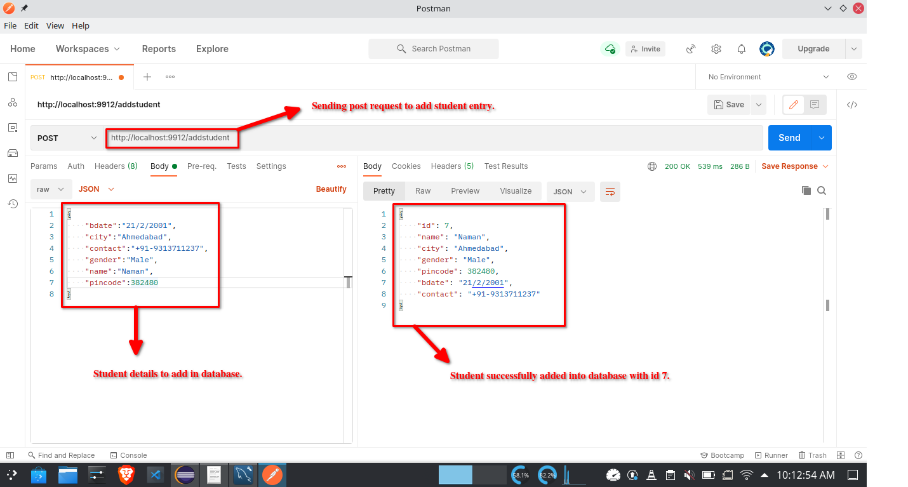
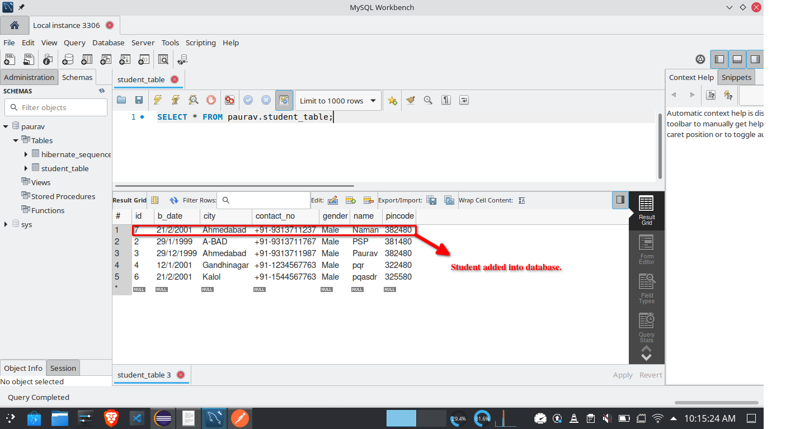

# Spring Boot RestAPI

## _RestApi with MySQL database with CRUD operations_

This RestAPI uses MySQL database and have table student and have attributes as follows.

| Student         |
| --------------- |
| Id(primary key) |
| name            |
| city            |
| gender          |
| pincode         |
| contact number  |
| birth date      |

## Prerequisites

- Installed MySQL server and workbench on system.
- java 11 installed on system
- Any JAVA IDE is required with spring boot plugin installed and configured.
- Postman for sending requests and receiving response.

## Installation

- Make sure your IDE is configured and MySQL server is up and running.
- To see the data open MySQL workbench and the moment the roject runs it will automatically create an table Student and declares attributes also.
- Open Project in IDE and configure `application.resource` according to your MySQL configuration on your system.
- Open `application.resource` and see `spring.datasource.url=jdbc:mysql://localhost:3306/paurav` line change `paurav` with database name you want to create.
- open MySQL workbench and fire this SQL statement to create database of your name which you changed inplace of paurav in that url

```
create database [your database name which you replaced with paurav in above url in `application.resource` file].
use [your database name].
```

- Run `DemoApplication.java` as a java application, if everything on your system is configured you should see the console with no errors.
- Open postman and start using RestAPI.

## Usage

- Make sure your MySQL server and application is running in IDE with no errors as stated in **Installation** section.
- If you changed `application.resource` file then see the port number which you assigned on that port id your application is running right now if not the go with the default configuration shown below.

&nbsp;

## Create

&nbsp;

#### To add student in database.

url pattenrn: **http://localhost:9912/addstudent**

```sh
{
    "bdate":"29/12/1999",
    "city":"Ahmedabad",
    "contact":"+91-9313711987",
    "gender":"Male",
    "name":"Paurav",
    "pincode":382480
}
```

- For example:


**Sending POST request to add one student.** 

&nbsp;

**Student added into the database.**

&nbsp;

#### To add multiple students in database.

url pattern : **http://localhost:9912/addstudents**

```sh
[
    {
        "bdate":"12/1/2001",
        "city":"Gandhinagar",
        "contact":"+91-1234567763",
        "gender":"Male",
        "name":"pqr",
        "pincode":322480
    },
    {
        "bdate":"12/1/2001",
        "city":"Gandhinagar",
        "contact":"+91-1234567763",
        "gender":"Male",
        "name":"pqr",
        "pincode":322480
    }
]
```
- For Example:


**Sending request to add multiple students in database.**


**Multiple students added into the database.**
&nbsp;

## Read

&nbsp;

#### To get list of all students from database

url pattern: **http://localhost:9912/students**

- For example:


**Getting all students from database.**
#### To get list of student by ID from database

url pattern: **http://localhost:9912/studentbyid/1**

- For Example:


**Getting student by id from database.**
&nbsp;

## Update

&nbsp;

#### To update existing student entry in database

url pattern: **http://localhost:9912/update**

- Passing JSON to student update entry by id.

```
{
        "id": 2,
        "name": "PSP",
        "city": "A-BAD",
        "gender": "Male",
        "pincode": 381480,
        "bdate": "29/1/1999",
        "contact": "+91-9313711767"
}
```

&nbsp;
- For Example:


**Updating student details in database.**


**Updated student details in database.**

&nbsp;

## Delete

&nbsp;

#### To delete student entry in database.

url pattern: **http://localhost:9912/delete/5**

- Passing id to delete student entry by that id.

- For Example:


**Deleting student details in database.**


**Deleted student details in database.**
